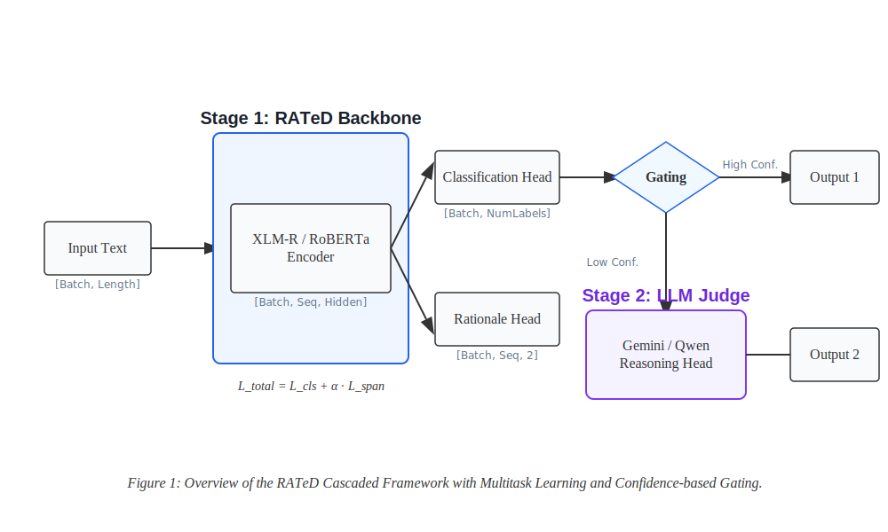

<p align="center">
  
</p>

# RATeD: A Rationalized Multitask Learning Framework for Explainable Toxic Expression Detection
[](https://opensource.org/licenses/MIT)
[](https://www.python.org/downloads/)
[](#introduction)

**RATeD** is a state-of-the-art Research Framework for Hate Speech Detection and Explainable AI (XAI). It implements a high-performance **Cascaded Architecture** designed to balance efficiency and accuracy in detecting toxic content across Vietnamese and English languages.

---

## 🌟 Introduction

In the evolving landscape of online safety, traditional black-box classification is no longer sufficient. **RATeD** (Rationalized Analysis and Toxic Expression Detection) introduces a dual-stage pipeline that not only classifies toxicity with SOTA accuracy but also provides **Rationales (Spans)** to justify every decision.

By combining a localized backbone model (Phase 1) with an advanced LLM Judge (Phase 2), RATeD identifies aggressive content, dehumanizing slurs, and offensive nuances while maintaining high interpretability through **Faithfulness** and **Plausibility** metrics.

## 🚀 Key Features

- **Cascaded Inference Engine**: A two-stage pipeline using a lightweight Backbone (XLM-R/RoBERTa) for fast-path inference and an LLM Judge (Gemini/Qwen) for complex cases.
- **Multitask Learning**: Joint optimization for Classification and Token-level sequence labeling (Rationale Extraction).
- **Cross-Lingual Support**: Optimized specifically for **Vietnamese (ViHOS)** and **English (HateXplain)** datasets.
- **Explainability Metrics**: Comprehensive evaluation using ERASER standards (Span IoU F1) and advanced Faithfulness metrics (Comprehensiveness & Sufficiency).
- **Localized Specialist Judges**: Supports localized fine-tuned models like Qwen-2.5-7B for offline, high-precision moderation.

---

## 🏗️ Architecture Overview

The system operates on a **Confidence-Gating** mechanism to optimize for both latency and scientific rigor.

<p align="center">
  
</p>

### Technical Stack
- **Languages**: Python 3.10+
- **Deep Learning**: PyTorch, Hugging Face Transformers
- **Backbone**: XLM-RoBERTa (VN), RoBERTa (EN)
- **Judges**: Google Gemini 2.5 Flash Lite, Qwen-2.5-7B (Fine-tuned)
- **Environment**: Conda with Mistral optimized stack

---

## 🛠️ Installation

1. **Clone the repository**
   ```bash
   git clone https://github.com/danny2904/RATeD-V.git
   cd RATeD-V
   ```

2. **Prepare Environment**
   We recommend using Conda to manage dependencies.
   ```bash
   conda create -n mistral310 python=3.10 -y
   conda activate mistral310
   pip install -r requirements_english.txt  # Or requirements for your specific task
   ```

3. **Configure Environment Variables**
   Create a `.env` file in the root directory:
   ```env
   GOOGLE_API_KEY=your_gemini_api_key_here
   HF_TOKEN=your_huggingface_token_here
   ```

## 🎨 Demo

We provide a specialized web interface to visualize the **Explainability Heatmaps** and the **Cascaded Reasoning Flow**.

### Prerequisites
Ensure you have `gradio` installed:
```bash
pip install gradio
```

### Running the Demo
```bash
python demo/app.py
```
This will launch a local web server (usually at `http://127.0.0.1:7860`).

**Features:**
- **Language Selection**: Toggle between Vietnamese and English pipelines.
- **Explainability Heatmap**: Visualizes token-level toxicity weights (Plausibility).
- **Execution Flow**: Displays whether the decision was made by the "Fast Path" (Backbone) or "Verified" by the LLM Judge.

---

## 🧪 Detailed Inference Guide

The `infer_en.py` and `infer_vn.py` scripts are designed for researchers to perform ablation studies and batch evaluations easily.

### Inference Modes:
1. **Cascaded (Recommended)**: The full RATeD pipeline. Stage 1 (Backbone) processes the input; if confidence is low, Stage 2 (LLM Judge) is invoked for verification and rationale fusion.
2. **Stage 1 Only (Backbone)**: Evaluates only the Discriminative model. Best for benching raw speed and baseline multitask performance.
3. **Stage 2 Only (Judge)**: An ablation mode that bypasses the backbone and sends all data to the LLM. Useful for measuring the "Knowledge Gap" between small models and LLMs.

### Quick Start (Interactive Menu)
To run a batch evaluation on the full test sets, simply use our interactive CLI tools:

#### English (HateXplain)
```bash
python infer_en.py
```
*Follow the on-screen menu to select **Mode 1 (Cascaded)** and **Gemini** to reproduce the 0.47 IoU results.*

#### Vietnamese (ViHOS)
```bash
python infer_vn.py
```
*Select **Mode 1 (Cascaded)** and **Qwen Specialist** to achieve 0.939 Accuracy.*

---

## 📊 Benchmark Results

Our Cascaded Framework achieves state-of-the-art performance in both classification accuracy and rationale plausibility.

### English (HateXplain)
| Metric           | Backbone | Cascaded  | Delta |
| :--------------- | :------: | :-------: | :---: |
| **Accuracy**     |  0.672   | **0.681** | +0.9% |
| **F1-Macro**     |  0.658   | **0.665** | +0.7% |
| **Span IoU F1**  |  0.442   | **0.474** | +3.2% |
| **Faithfulness** |  0.481   | **0.529** | +4.8% |

### Vietnamese (ViHOS)
| Metric        | Backbone | Cascaded  | Delta |
| :------------ | :------: | :-------: | :---: |
| **Accuracy**  |  0.914   | **0.939** | +2.5% |
| **F1-Macro**  |  0.912   | **0.938** | +2.6% |
| **Token MF1** |  0.824   | **0.866** | +4.2% |

---

## 📂 Project Structure

```text
RATeD/
├── experiments/
│   ├── english/
│   │   ├── baseline/      # Comparative baseline models
│   │   ├── proposed/      # Cascaded logic & Training scripts
│   │   └── data/          # Prepared datasets
│   └── vietnamese/
│       ├── proposed/      # Vietnamese implementation
│       ├── models/        # Fine-tuned checkpoints
│       └── data/          # Prepared datasets
├── reports/               # Generated metrics, logs, and visualization figures
├── infer_en.py            # Main entry point for English Research
├── infer_vn.py            # Main entry point for Vietnamese Research
└── .env                   # Configuration secrets (Ignored by Git)
```

---

## 🗺️ Roadmap

- [x] Integration of Gemini 2.5 Flash Lite as Stage 2 Judge.
- [x] Fine-tuning Qwen-2.5-7B as a Local Specialist Judge.
- [x] Gap-filling and Dilation heuristics for Human-aligned Spans.
- [ ] Support for Multi-turn Conversation Moderation.
- [ ] Lightweight RAG integration for dynamic Slang Knowledge Bases.
- [ ] Real-time API deployment via FastAPI.

## 🤝 Contribution

Contributions are what make the open-source community an amazing place to learn, inspire, and create. Any contributions you make are **greatly appreciated**.

1. Fork the Project
2. Create your Feature Branch (`git checkout -b feature/AmazingFeature`)
3. Commit your Changes (`git commit -m 'Add some AmazingFeature'`)
4. Push to the Branch (`git push origin feature/AmazingFeature`)
5. Open a Pull Request

## 🖋️ Author

**Josh Swift**

- GitHub: [@danny2904](https://github.com/danny2904)
- Email: [lethanh294@gmail.com](mailto:lethanh294@gmail.com)

Built with ❤️ by [danny2904](https://github.com/danny2904).

## 📄 License

Distributed under the **MIT License**. See `LICENSE` for more information.

---

