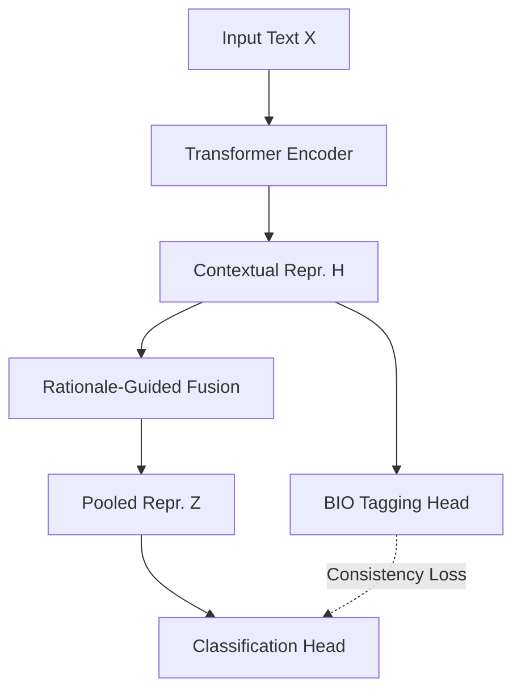
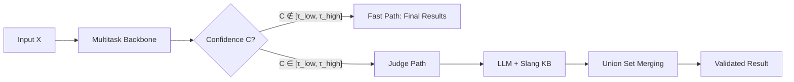

# Methodology: Uncertainty-Aware Cascaded Verification

The RATeD-V framework integrates a multitask training strategy with a cascaded verification pipeline. This architecture ensures that toxicity detection is both efficient and grounded in human-readable evidence.

---

## 3. Method

### 3.1. Multitask training methodology

Figure 1 illustrates the overall architecture of the proposed RATeD-V framework, highlighting the multitask transformer backbone and the rationale-guided fusion mechanism.


*Figure 1: Overall architecture of RATeD-V featuring shared encoder and attention-based fusion.*

RATeD-V is built upon a unified multitask transformer backbone that jointly learns sentence-level toxicity detection and token-level toxic span extraction in a single training stage. Given an input sequence $X = \{x_1, \ldots, x_L\}$, a transformer encoder $E$ produces contextualized representations $H = \{h_1, \ldots, h_L\}$. Two task-specific heads are defined on top of the shared representations: a sentence classification head for predicting the toxicity label and a BIO-based sequence labeling head for identifying toxic spans.

The backbone is optimized using a joint objective that explicitly couples global predictions with token-level evidence:
$$\mathcal{L}_{total} = \lambda_1 \mathcal{L}_{cls} + \lambda_2 \mathcal{L}_{token} + \lambda_3 \mathcal{L}_{cons}$$
where $\mathcal{L}_{cls}$ denotes the sentence-level classification loss, $\mathcal{L}_{token}$ denotes the token-level BIO tagging loss, and $\mathcal{L}_{cons}$ enforces a consistency constraint between the sentence-level decision and the extracted rationale tokens.

To ensure that classification is grounded in explicit toxic evidence, RATeD-V incorporates a **Rationale-Guided Fusion** mechanism. An attention distribution $\alpha$ is computed over the contextual representations $H \in \mathbb{R}^{L \times d}$, and a rationale-aware sentence representation is obtained by attention pooling:
$$Z = \sum_{i=1}^{L} \alpha_i h_i$$
The pooled representation $Z$ is then used by the classification head, forcing the model to focus on span-level cues during decision making. This multitask formulation integrates toxic span extraction as a core component of the detection process rather than an auxiliary output.

---

### 3.2. Cascaded verification pipeline

The uncertainty-aware routing and the subsequent collaborative verification process are illustrated in Figure 2, detailing the dual-path inference workflow.


*Figure 2: Cascaded inference workflow with confidence-gated routing and LLM-Judge verification.*

During inference, RATeD-V adopts a cascaded verification pipeline in which the multitask backbone acts as the primary predictor and a specialist LLM judge is selectively invoked for ambiguous cases. For a given input $X$, the backbone outputs a sentence-level posterior distribution $P(y \mid X)$, a set of predicted toxic spans $S_{backbone}$, and a confidence score defined as:
$$C = \max_y P(y \mid X)$$
An ambiguity region $\mathcal{U} = [\tau_{low}, \tau_{high}]$ is introduced to identify samples that require further verification. The routing policy is defined as:
$$ \text{Path}(X) = 
\begin{cases} 
\text{Fast Path} & \text{if } C \notin \mathcal{U} \\
\text{Judge Path} & \text{if } C \in \mathcal{U} 
\end{cases}
$$
Samples routed through the fast path are returned directly with the backbone predictions. In contrast, samples whose confidence lies inside the ambiguity region are forwarded to a collaborative verification stage with a specialist LLM judge. This uncertainty-aware gating mechanism allows RATeD-V to preserve the reliability of confident predictions while explicitly targeting linguistically complex or ambiguous cases for further inspection.

---

### 3.3. Collaborative verification mechanism

For samples satisfying $C \in \mathcal{U}$, RATeD-V activates a collaborative verification stage implemented by a specialist LLM-Judge ($M_{judge}$). In contrast to teacher–student or post-hoc refinement settings, the LLM judge performs an **independent cross-validation** on the original input text $X$ and does not consume the backbone predictions or extracted spans. This design explicitly prevents error propagation from the backbone to the verification module.

To support reliable reasoning in highly informal and culturally nuanced social media contexts, RATeD-V incorporates a **Lightweight Retrieval-Augmented Prompting (RAG)** mechanism. A domain-specific **Slang Knowledge Base (K)** is constructed from the training and development splits by collecting high-frequency slang expressions, teencode patterns, and context-dependent toxic phrases.

Formally, the collaborative verification step is defined as:
$$(y_{judge}, S_{judge}) = M_{judge}(X, K)$$
The collaborative stage consists of two operations. First, the LLM-Judge independently validates the toxicity label based on the input text and the retrieved slang context. Second, it extracts an auxiliary set of toxic spans $S_{judge}$ that complements the backbone predictions. The final set of toxic spans is constructed by a union-based merging strategy:
$$S_{final} = (S_{backbone} \cup S_{judge}) \cdot \mathbb{1}(y_{judge} \neq \text{SAFE})$$
This union-set merging is intentionally adopted to preserve short, implicit, and context-dependent toxic expressions while retaining the backbone spans as stable anchors. The overall inference procedure is summarized in Algorithm 1.

```text
Algorithm 1: Rationale-Aware Cascaded Verification
-------------------------------------------------------------------------
Input:  Input Text X, Thresholds {τ_low, τ_high}, Slang KB K
Output: Final Label y*, Rationale Spans S*
-------------------------------------------------------------------------
1:  procedure RATeD-V_Inference(X, τ, K)
2:      # --------- Phase 1: Primary Inference & Gating ---------
3:      (y_b, S_b, C) ← M_backbone(X)             ▷ Extract Confidence Score
4:      
5:      if C ∉ [τ_low, τ_high] then return (y_b, S_b) ▷ Fast-Path Bypass
6:      
7:      # --------- Phase 2: Collaborative Refinement ---------
8:      (y_j, S_j) ← M_judge(X, K)               ▷ RAG-enhanced Validation
9:      S* ← (S_b ∪ S_j) · 𝟙(y_j ≠ SAFE)         ▷ Union-set Indicator Merging
10:     
11:     # --------- Final Decision ---------
12:     return (y_j, S*)
13: end procedure
-------------------------------------------------------------------------
```

---

## 4. Comparative Summary Table

| Feature                              | English (HateXplain) | Vietnamese (ViHOS)                    |
| :----------------------------------- | :------------------- | :------------------------------------ |
| **Model Backbone**                   | RoBERTa-base         | XLM-RoBERTa-base                      |
| **Ambiguity Region ($\mathcal{U}$)** | $[0.45, 0.98]$       | $C \in (Safe_{0.98}, Toxic_{0.90})^c$ |
| **Slang KB Source**                  | Mined (Train+Dev)    | Mined (Train+Dev)                     |
| **Refinement Logic**                 | 3-Class Re-labeling  | Binary Verification                   |

---

## 5. Experiments

### 5.1. Baselines

Để đánh giá **RATeD-V** dưới góc độ hệ thống trên cả hai ngôn ngữ, chúng tôi so sánh framework với các phương pháp nhận diện độc hại (toxic identification) dựa trên Encoder-based và LLM-based thường được xem xét triển khai thực tế.

**Encoder-based Baselines:** Nhóm này bao gồm các mô hình Transformer SOTA được tinh chỉnh (fine-tuned) cho nhiệm vụ multitask (phân loại câu và trích xuất bằng chứng). 
- **Đối với tiếng Anh (English):** Chúng tôi sử dụng **RoBERTa (Base)** fine-tune trên tập dữ liệu **HateXplain** làm backbone cơ sở. 
- **Đối với tiếng Việt (Vietnamese):** Chúng tôi sử dụng **PhoBERT (Base) V2** và **XLM-RoBERTa (Base)** trên tập dữ liệu **ViHOS**. 
Ngoài ra, các biến thể đa ngôn ngữ và mô hình nén như **mBERT** (Cased/Uncased) và **Distil-mBERT** cũng được đánh giá trên cả hai tập dữ liệu để xem xét ảnh hưởng của dung lượng mô hình đến hiệu năng trích xuất rationale.

**LLM-based Baselines:** Nhóm thứ hai bao gồm các LLM zero-shot được đánh giá song song trên cả HateXplain và ViHOS. Các hệ thống thương mại bao gồm **Gemini 2.5 Flash** và **GPT-4o-mini**, cùng với mô hình mã nguồn mở **Qwen2.5-7B-Instruct** đại diện cho các LLM có thể triển khai cục bộ. Mặc dù các mô hình này có khả năng suy luận mạnh mẽ, chúng thường gặp khó khăn trong việc trích xuất chính xác các span từ vựng nhạy cảm trong ngôn ngữ không chính thống (informal text), đặc biệt là với tiếng Việt. Một baseline **Single-Stage (E1 Baseline)** cũng được đưa vào cho cả hai ngôn ngữ để xác lập ngưỡng hiệu năng của mô hình multitask gốc khi không có quy trình xác thực phân tầng (no-verification conditions).

### 5.2. Evaluation Metrics

Do đặc thù về cấu trúc nhãn và mục tiêu nghiên cứu của từng tập dữ liệu, chúng tôi áp dụng các bộ chỉ số đánh giá chuyên biệt cho từng ngôn ngữ.

#### 5.2.1. English (HateXplain)
Bộ chỉ số được thiết kế để đánh giá khả năng phân loại 3 lớp (Hate, Offensive, Normal) và tính công bằng:
- **Classification:** Sử dụng **Accuracy** và **Macro-F1** cho bài toán 3 lớp. Ngoài ra, **AUROC** được tính để đo lường độ tin cậy của xác suất dự đoán.
- **Explainability (ERASER):** Áp dụng chuẩn **Span IoU F1** với ngưỡng $\tau = 0.5$ và **Token mF1**. Chúng tôi cũng báo cáo **AUPRC** cho các token rationale để đánh giá khả năng xếp hạng mức độ độc hại của từng từ.
- **Fairness & Bias:** Sử dụng **Generalized Mean Bias (GMB)** để đánh giá sự thiên kiến đối với 11 nhóm định danh (identity groups) như *African, Arab, LGBTQ+*,... thông qua giá trị trung bình lũy thừa (Power Mean) với $p = -5$.
- **Faithfulness** (Comprehensiveness & Sufficiency), đo lường mức độ sụt giảm hiệu năng khi loại bỏ (masking) các rationale đã được dự đoán.
#### 5.2.2. Vietnamese (ViHOS)
Đối với tiếng Việt, chúng tôi tuân thủ các chuẩn đo lường của **ViHateT5** (Nguyen et al., 2024) và tập trung vào đặc thù ngôn ngữ đơn lập:
- **Classification:** Do ViHOS là bài toán phân loại nhị phân (Hate vs. Non-hate), bộ chỉ số tập trung vào **Accuracy, Precision, Recall** và **Macro-F1** ở mức câu.
- **Span Extraction (Character-level):** Khác với tiếng Anh, việc trích xuất bằng chứng tiếng Việt được đánh giá ở **cấp độ ký tự (Character-level)** với chuẩn hóa **NFC** để đảm bảo tính chính xác cho các từ có dấu. Chúng tôi báo cáo **Accuracy, Character-level Macro F1** và **Weighted F1** cho từng câu.

### 5.3. Sensitivity Analysis

The influence of the gating threshold $\tau$ on the classification performance and explainability of RATeD-V is illustrated in Figure 3. The multi-pane analysis demonstrates the trade-off between backbone efficiency and LLM reasoning across both English and Vietnamese datasets.


*Figure 3: Influence of gating threshold $\tau$ on performance metrics (Accuracy, F1) and explainability (Span IoU/mF1) across Stage-2 inference.*

### 4.4. Impact of Rationale Supervision Weight ($\alpha$)

Trình bày trong Hình 4 là kết quả khảo sát tác động của trọng số giám sát rationale ($\alpha$) đối với tập dữ liệu English (HateXplain). Thử nghiệm này bóc tách cách mô hình multitask phản ứng khi thay đổi mức độ ưu tiên của việc trích xuất span so với phân loại câu.


*Figure 4: Impact of Rationale Supervision Weight $\alpha$ on classification macro-F1, explainability (IoU F1, Token F1), and bias (GMB-Subgroup AUC) for HateXplain.*

Quan sát cho thấy giá trị $\alpha$ đóng vai trò quyết định trong việc kích hoạt khả năng giải thích của mô hình. Tại $\alpha=0$, mặc dù độ chính xác phân loại vẫn cao, nhưng mô hình gần như không thể trích xuất chính xác các bằng chứng độc hại (IoU F1 $\approx 0.02$). Khi tăng $\alpha$ lên các ngưỡng từ $10^{-1}$ đến $10^1$, chúng ta thấy sự cải thiện đột biến về các chỉ số explainability trong khi vẫn bảo toàn được tính ổn định của Macro F1 và khả năng giảm thiểu bias (GMB AUC). Dự án lựa chọn $\alpha=10$ làm tham số tiêu chuẩn để đạt được sự cân bằng tối ưu giữa các mục tiêu đa nhiệm.

### 5.4. Ablation Study

Để đánh giá đóng góp độc lập của cấu trúc multitask và tầng xác thực phân tầng, chúng tôi thực hiện thử nghiệm bóc tách (Ablation Study) trên ba cấu hình. Độ chính xác (**Accuracy**) được báo cáo là chỉ số phân loại cấp độ câu (Sentence-level Classification) trên tập Test của hai tập dữ liệu:

1.  **Only Stage-1 (Backbone):** Chỉ sử dụng mô hình encoder đã tinh chỉnh đa nhiệm.
    *   **English:** `roberta-base` tinh chỉnh trên HateXplain (Log: `experiments/english/baseline/results/RATeD_E1_baseline/`).
    *   **Vietnamese:** `xlm-roberta-base` tinh chỉnh trên ViHOS (Log: `experiments/vietnamese/baseline/results/xlm-roberta-base/`).
2.  **Only Stage-2 (LLM Standalone):** Sử dụng các mô hình ngôn ngữ lớn ở chế độ Zero-shot (không tinh chỉnh).
    *   **English:** `Qwen2.5-7B-Instruct` (Log: `experiments/english/baseline/results/Qwen2_5_7B_Instruct/`).
    *   **Vietnamese:** `Qwen2.5-7B-Instruct` (Log: `experiments/vietnamese/baseline/results/Qwen2_5_7B_Instruct/`).
3.  **Both (Cascaded RATeD-V):** Hệ thống đề xuất đầy đủ kết hợp cả hai giai đoạn.
    *   **English:** Tích hợp `roberta-base` và `Qwen-7B Specialist` (Log: `experiments/english/proposed/results/`).
    *   **Vietnamese:** Tích hợp `xlm-roberta-base` và `Qwen-7B Specialist` (Log: `experiments/vietnamese/proposed/results/`).

Kết quả minh họa tại Hình 4 khẳng định rằng cách tiếp cận cascaded đạt hiệu suất cao nhất đồng nhất trên cả hai ngôn ngữ, đặc biệt là vượt qua ngưỡng giới hạn của LLM zero-shot thông thường.


*Figure 5: Ablation study comparing the effectiveness of independent stages (Backbone vs. LLM) versus the proposed cascaded RATeD-V framework in term of Sentence-level Accuracy.*

---
> [!IMPORTANT]
> This hierarchical design ensures that the RATeD-V system remains robust against linguistic complexity (e.g., teencode, sarcasms) by leveraging LLM reasoning only when the base model exhibits high uncertainty.
